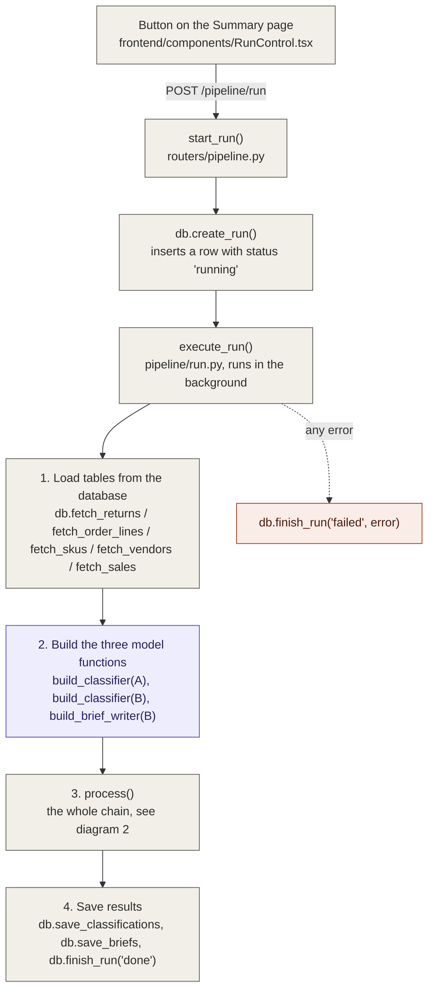
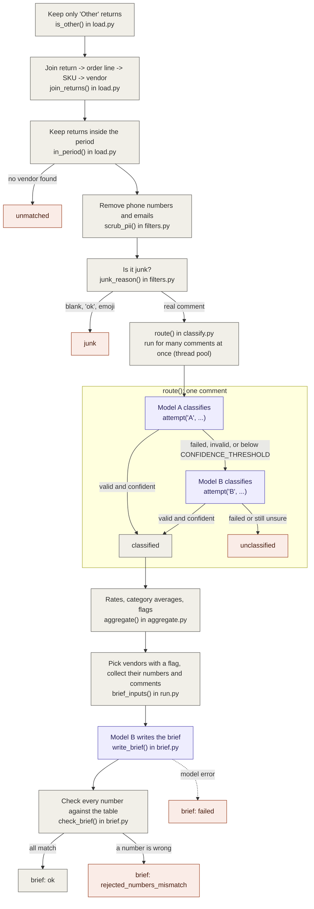
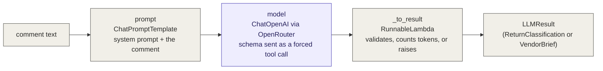
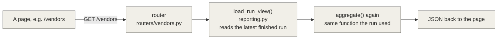

# How the pipeline code flows

Read this next to `backend/app/pipeline/run.py`. Every box names the function that does the step.

Legend: gray = plain code, purple = model call (LangChain), coral = failure bucket.

## 1. What happens when "Run pipeline" is pressed

## 2. Inside `process()` (pipeline/run.py)

## 3. Inside one model call (the LangChain chain)

Built once by `structured_call()` in `classify.py`, used for both classification and the brief.

## 4. How a dashboard page gets its numbers

Nothing is calculated in the browser, and no model is called when a page loads.

## Which file to open for what

| Question | File |
|---|---|
| What order do the steps run in? | `pipeline/run.py` (`process`) |
| How is a return linked to a vendor? | `pipeline/load.py` |
| What counts as junk? What is scrubbed? | `pipeline/filters.py` |
| What does the model get asked? How does A hand over to B? | `pipeline/classify.py` |
| How are rates and flags calculated? | `pipeline/aggregate.py` |
| How is the brief written and checked? | `pipeline/brief.py` |
| What shape must the model's answer have? | `schemas.py` |
| Which reasons exist and who owns each? | `taxonomy.py` |
| All SQL | `db.py` |
